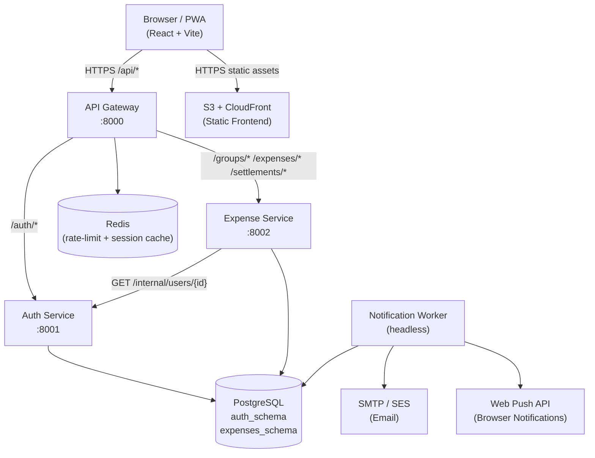
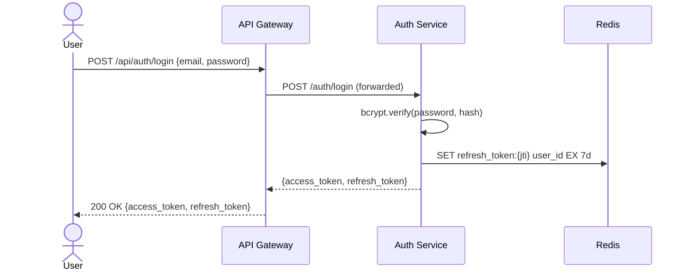
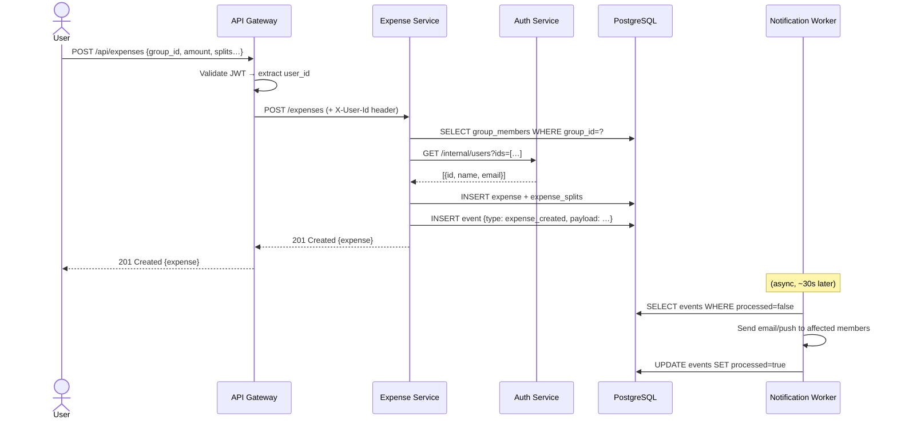
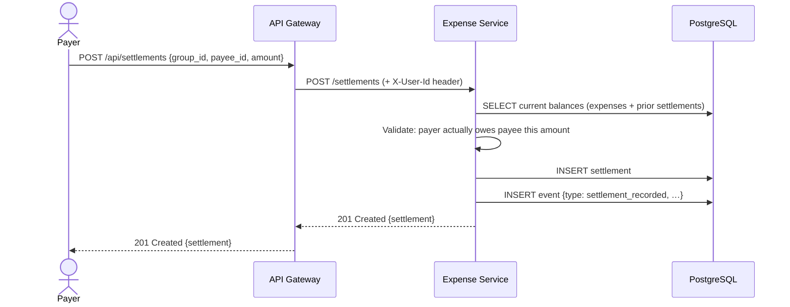
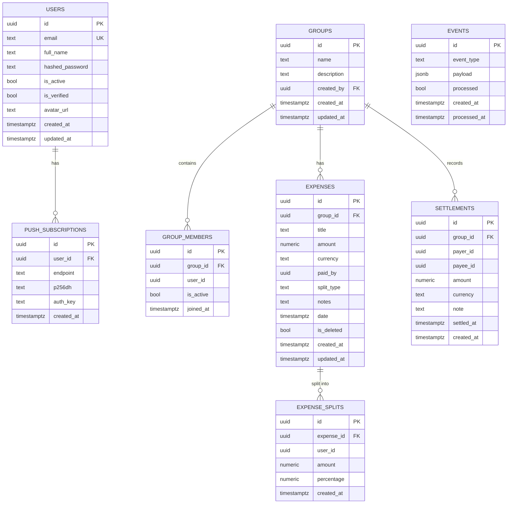
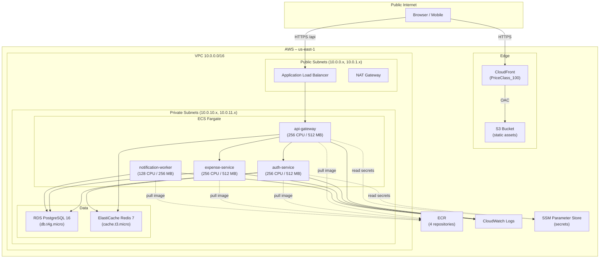

# SplitEase – Architecture Documentation

## Table of Contents

1. [System Overview](#1-system-overview)
2. [Service Responsibilities](#2-service-responsibilities)
3. [Key Data Flows](#3-key-data-flows)
4. [Database Schema](#4-database-schema)
5. [API Gateway Routing Table](#5-api-gateway-routing-table)
6. [PWA Offline Strategy](#6-pwa-offline-strategy)
7. [AWS Deployment Architecture](#7-aws-deployment-architecture)
8. [Design Decisions](#8-design-decisions)

---

## 1. System Overview

SplitEase is a Splitwise-style expense sharing application. The backend is
decomposed into three synchronous micro-services behind a single API gateway,
plus one asynchronous background worker for notifications.



---

## 2. Service Responsibilities

### API Gateway (port 8000)

The gateway is the single entry-point for all client requests. It:

- **Routes** requests to the correct downstream service by path prefix.
- **Rate-limits** anonymous and authenticated requests using a sliding-window
  counter stored in Redis (e.g. 100 req/min per IP, 500 req/min per user).
- **Authenticates** requests by validating the JWT locally (shared `SECRET_KEY`)
  and forwarding `X-User-Id` and `X-User-Email` headers to downstream services.
- **Does not own any database tables** – it is entirely stateless apart from Redis.

Key routes:

| Prefix | Forwarded to |
|--------|-------------|
| `/api/auth/*` | auth-service |
| `/api/groups/*` | expense-service |
| `/api/expenses/*` | expense-service |
| `/api/settlements/*` | expense-service |
| `/api/users/*` | auth-service |

### Auth Service (port 8001)

Owns user identity and session management. Responsibilities:

- User registration with email-verification flow.
- Login with bcrypt-hashed passwords; issues short-lived JWT access tokens
  (15 min) and long-lived refresh tokens stored server-side in Redis.
- Password reset via time-limited email tokens.
- Web Push subscription storage (VAPID key management).
- Internal endpoint `GET /internal/users/{id}` consumed by expense-service to
  enrich expense data with user names and avatars.

Database schema: `auth_schema`

### Expense Service (port 8002)

Owns all financial data. Responsibilities:

- CRUD for **groups** (collections of users who share expenses).
- CRUD for **expenses** with three split modes: `equal`, `exact`, `percentage`.
- **Debt simplification** – Greedy graph algorithm (`utils/debt_simplification.py`)
  that reduces N*(N-1) raw debts to the minimum number of transactions needed
  to settle a group.
- CRUD for **settlements** (recording that one member paid another outside the app).
- Emits internal events (database rows in an `events` table) that the
  notification-worker polls.

Database schema: `expenses_schema`

### Notification Worker (headless)

A long-running async process (no HTTP server). Responsibilities:

- **Polls** the `expenses_schema.events` table every 30 seconds for unprocessed
  events (`expense_created`, `settlement_recorded`, `expense_updated`).
- For each event it resolves the relevant user IDs and dispatches:
  - **Email notifications** via SMTP (aiosmtplib).
  - **Web Push notifications** via the browser Push API (pywebpush).
- Marks events as `processed` after successful dispatch.

This design (polling + DB events) avoids introducing a message broker (RabbitMQ/
SQS) while keeping the worker decoupled from the main services.

---

## 3. Key Data Flows

### 3.1 User Login



### 3.2 Create Expense



### 3.3 Settle Debt



---

## 4. Database Schema

Both schemas live in the same PostgreSQL instance. Each service owns its own
schema and only accesses the other's data through internal HTTP calls (no
cross-schema JOINs in application code).



---

## 5. API Gateway Routing Table

All paths below are relative to the gateway base URL (`:8000`).

| Method | Path | Service | Auth Required | Description |
|--------|------|---------|---------------|-------------|
| POST | `/api/auth/register` | auth | No | Create account |
| POST | `/api/auth/login` | auth | No | Issue tokens |
| POST | `/api/auth/refresh` | auth | Refresh token | Rotate access token |
| POST | `/api/auth/logout` | auth | Yes | Revoke refresh token |
| POST | `/api/auth/forgot-password` | auth | No | Send reset email |
| POST | `/api/auth/reset-password` | auth | No | Apply new password |
| GET | `/api/users/me` | auth | Yes | Current user profile |
| PATCH | `/api/users/me` | auth | Yes | Update profile |
| POST | `/api/users/me/push-subscription` | auth | Yes | Register push sub |
| GET | `/api/groups` | expense | Yes | List my groups |
| POST | `/api/groups` | expense | Yes | Create group |
| GET | `/api/groups/{id}` | expense | Yes | Get group details |
| PATCH | `/api/groups/{id}` | expense | Yes | Update group |
| POST | `/api/groups/{id}/members` | expense | Yes | Add member |
| DELETE | `/api/groups/{id}/members/{uid}` | expense | Yes | Remove member |
| GET | `/api/groups/{id}/balances` | expense | Yes | Get simplified debts |
| GET | `/api/expenses` | expense | Yes | List expenses (paginated) |
| POST | `/api/expenses` | expense | Yes | Create expense |
| GET | `/api/expenses/{id}` | expense | Yes | Get expense |
| PATCH | `/api/expenses/{id}` | expense | Yes | Update expense |
| DELETE | `/api/expenses/{id}` | expense | Yes | Soft-delete expense |
| POST | `/api/settlements` | expense | Yes | Record settlement |
| GET | `/api/groups/{id}/settlements` | expense | Yes | List settlements |
| GET | `/api/health` | gateway | No | Gateway health check |

---

## 6. PWA Offline Strategy

SplitEase ships as a Progressive Web App with a service worker (Workbox) that
enables basic offline usage:

### What works offline

| Feature | Strategy | Notes |
|---------|----------|-------|
| App shell (HTML/JS/CSS) | Cache-first | Served from precache on first load |
| Group list | Stale-while-revalidate | Shows last-known data; refreshes in bg |
| Individual expense detail | Stale-while-revalidate | Cached per expense ID |
| Profile page | Cache-first | Rarely changes |
| Creating expenses | Background sync | Queued in IndexedDB; sent when online |

### What requires connectivity

- Login / registration (JWT issuance)
- Real-time balance recalculation (relies on server-side debt simplification)
- Settlement recording

### Service Worker caching layers

```
┌────────────────────────────────────────────────────────┐
│  Precache (build time)                                 │
│  index.html, main.js, main.css, icons, fonts           │
├────────────────────────────────────────────────────────┤
│  Runtime cache: API responses                          │
│  /api/groups   → stale-while-revalidate, max 50 items  │
│  /api/expenses → stale-while-revalidate, max 100 items │
├────────────────────────────────────────────────────────┤
│  Background sync queue                                 │
│  POST /api/expenses  → retried when connection returns │
└────────────────────────────────────────────────────────┘
```

Push notifications (VAPID) are delivered even when the app is closed. The
service worker's `push` event handler shows a notification with the expense
title and the amount owed, deep-linking back into the group on click.

---

## 7. AWS Deployment Architecture



### Cost estimate (us-east-1, minimal traffic)

| Resource | Monthly cost (approx.) |
|----------|----------------------|
| ECS Fargate (4 tasks × 0.25 vCPU) | ~$8 |
| RDS db.t4g.micro (single-AZ) | ~$12 |
| ElastiCache cache.t3.micro | ~$12 |
| ALB | ~$16 |
| NAT Gateway | ~$32 |
| CloudFront (PriceClass_100) | <$1 |
| S3 | <$1 |
| ECR (4 repos) | <$1 |
| CloudWatch Logs | ~$1 |
| **Total** | **~$83/month** |

> The NAT Gateway is the dominant cost. For a hackathon / side project, you
> can reduce cost by assigning public IPs to ECS tasks (remove the NAT GW)
> and tightening security groups. That saves ~$32/month.

---

## 8. Design Decisions

### Why a shared PostgreSQL database instead of one DB per service?

A strict microservices architecture would give each service its own database,
preventing direct cross-service data access. For a project of this scale
(3-4 developers, <10k users), that would add significant operational complexity:

- Cross-service JOINs become expensive HTTP calls or data duplication.
- Running 3 separate RDS instances costs ~3× more (~$36/month vs ~$12/month).
- Database migrations across multiple instances require more coordination.
- Local development becomes harder (more containers, more config).

Instead we use **separate PostgreSQL schemas** (`auth_schema`, `expenses_schema`)
within one instance. This gives us:

- **Logical isolation** – application code targets a specific schema, making
  cross-service DB access a deliberate choice that can be audited.
- **Operational simplicity** – one backup policy, one connection pool, one set
  of Alembic migration runs.
- **Easy migration path** – if the expense-service ever needs its own DB
  (e.g. for a heavily-loaded production system), the schema is already isolated
  and can be migrated with `pg_dump --schema=expenses_schema`.

### Why poll the events table instead of using Redis pub/sub or SQS?

- Adds zero infrastructure dependencies (the DB is already there).
- Survives worker restarts without losing events (events stay in DB until marked processed).
- Simpler to debug – you can `SELECT * FROM expenses_schema.events WHERE processed=false` to see the queue.
- At the scale of a college project (<100 notifications/minute), 30-second polling latency is acceptable.

### Why FastAPI over Django/Flask?

- Native `async/await` support with `asyncpg` means true non-blocking I/O under load.
- Automatic OpenAPI docs (`/docs`) are invaluable during development and demos.
- Pydantic v2 models provide both runtime validation and TypeScript-compatible schema generation.
- Alembic integrates cleanly for schema migrations regardless of the HTTP framework.

### Why Vite + React over Next.js?

- A pure SPA is simpler to deploy (just an S3 bucket + CloudFront – no server needed).
- No server-side rendering requirements (the app is behind authentication anyway).
- Vite's dev server + HMR is noticeably faster than Next.js for rapid iteration.
- The PWA/service-worker setup is more straightforward with Vite PWA plugin.
